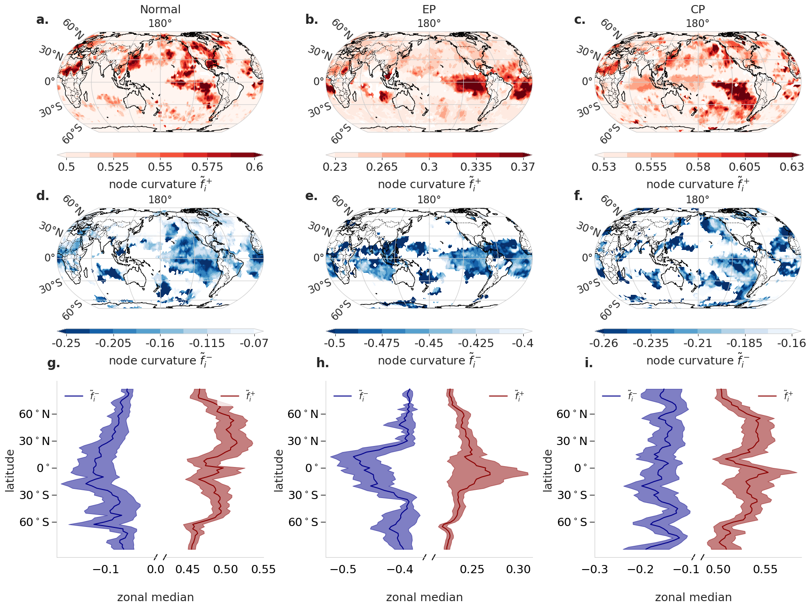

# Teleconnection patterns of different El Ni ̃no types1revealed by climate network curvature
Ricci-curvature applied to climate networks to study teleconnection patterns of ENSO diversity.

An intuition on network curvature:


## Clone the repo and install all required packages 

### 1. Clone repository with submodules:
```
git clone --recurse-submodules https://github.com/mlcs/climnet.git
```

### 2. Installing packages
To reproduce our analysis described in the paper follow these steps:
We recommend to create a new environment and install all required packages by running: 
```
conda env create -f submodules/climnet/condaEnv.yml 
conda activate climnetenv 
pip install graphriccicurvature 
pip install -e submodules/climnet 
```

### 3. Download data
Download 2m temperature data from [ERA5](https://cds.climate.copernicus.eu/cdsapp#!/dataset/reanalysis-era5-pressure-levels?tab=overview) and store the merged files in the data folder.

## Reproduce plots

1. Create the corresponding networks
```
python bin/t2m_create_net.py -data 'datapath' -s 'standard'
python bin/t2m_create_net.py -data 'datapath' -s 'Nino_EP'
python bin/t2m_create_net.py -data 'datapath' -s 'Nino_CP'
```
2. Reproduce plots in the paper by running 
```
python bin/paperplots.py -d 'datapath' -ep 'epNetPath' -cp 'cpNetPath' -normal 'normalNetPath'
```


The figures should look somehow similiar to the following:

***


***


***


The networks used for this plots are stored in 'outputs/t2m_1950-2020_nino_nets'.